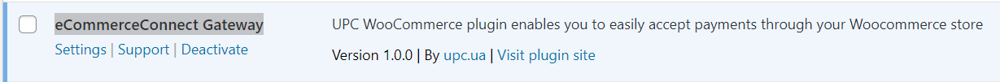
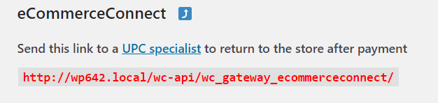

# eCommerceConnect plugin for WordPress (WooCommerce versions >= 8.3 with blocks support) for Ukraine

## Dependencies
- Requires WordPress at least: 6.3
- Tested up to: 6.4
- WC requires at least: 8.3
- WC tested up to: 8.6
- Requires PHP: 7.4

### Compatibility
This extension is compatible with:
- [WooCommerce Blocks](https://woo.com/document/cart-checkout-blocks-status/)

### Activation
Before using the extension, you need to apply for Internet acquiring from Ukrainian Processing Center

### Installation and configuration
1. Unzip the UPC extension (wordpress-woocommerce-8.3ua .zip > Unzip) and download the folder woocommerce-ecommerceconnect-gateway manually to the wp-plugins folder.
2. Go to the admin panel

In the menu Plugins once downloaded, click Install and Activate the plugin eCommerceConnect Gateway


Go to WooCommerce > Settings and the Payments tab. Find eCommerceConnect in the list of extensions and click Manage


3. Generate the public / private key pair with merchant crt according to the instructions from Ukrainian Processing Center
4. Copy the PEM key file to the server:

   Sandbox: wp-content/plugins/woocommerce-ecommerceconnect-gateway/cert/test/
   
   Prod: wp-content/plugins/woocommerce-ecommerceconnect-gateway/cert/prod/
   
5. Provide the *Callback URL* to the Ukrainian Processing Center to enable online payment notifications   


7. Enable *Sandbox* mode in the plugin settings
8. Disable *Sandbox* mode when ready to accept live payments
9. Merchant ID, Terminal ID fields are required

## How to change the status of the order after payment

### Who will be interested
If you are looking for why your Woo store order statuses after payment with this plugin are set to Completed, this is the place for you.

### Task overview
How to change the automatic switching `of an order to the “processing” status instead of the “completed” status after a successful payment by a customer.
As you know from the WooCommerce documentation, by default, the order status after successful payment should be set from Pending to Processing. But this does not happen with this plugin. Instead, after a successful payment, the order status is changed from Pending to Completed.

>By default, WooCommerce will only auto-complete paid orders for products that are both Virtual and Downloadable, assuming that the shop needs to fulfill/ship any orders that don’t meet these criteria.

### Why this is so
Apparently, the developers focused on Woo stores where the products are virtual, not physical. This is convenient for virtual goods, because they do not have any stages of order fulfillment and delivery. It's impossible to provide convenience for both types of products, so they chose one.

So this is not a bug, but rather a feature for virtual goods. Although, in terms of following the best practices specified in the WooCommerce documentation, the plugin breaks the process. And this can interfere with the implementation of other plugins that rely on the standard stages of the store's order process.

### What to do for stores with physical goods
Since the plugin doesn't offer any settings in this regard in the admin panel, we have to make some changes to its code.
You need to find the `set_status()` function in the plugin code. The code looks like this:

```php
$order->set_status(“wc-completed”);
```

the string value “wc-completed” must be replaced with “wc-processing”.
As a result, the line in the plugin code will look like this:				
```php
$order->set_status(“wc-processing”);
```

### We Tested in Practice
We tested the above changes on our store in prod 
https://go.iot-devices.com.ua/shop
and it works fine

### Links to WooCommerce documentation
https://woocommerce.com/document/managing-orders/order-statuses/

https://woocommerce.github.io/code-reference/classes/WC-Abstract-Order.html#method_set_status
